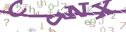

# QingMVC 验证码组件

qingmvc captcha component

- http://qingmvc.com
- http://qingcms.com
- http://logo234.com  
- http://mangdian.net  

## 验证码字符串生成器

- math : 数学公式 1+2=?
- string : 字符串

## 验证码视图

- 普通视图 : view 白色空白背景
- 高级视图 : AdvView 点状背景干扰和线状背景干扰

# 案例


## CaptchaX静态函数工具类

```
//qingmvc\captcha\CaptchaX
<?php
use qingmvc\captcha;

$cap=captcha\CaptchaX::math();
$view=$cap->getView();
$view->width=120;
$cap->show();

//
captcha\CaptchaX::advMath()->show();
captcha\CaptchaX::math()->show();
captcha\CaptchaX::advStr()->show();
captcha\CaptchaX::str()->show();
?>
```

## 定制

```
<?php
use qingmvc\captcha;

//创建组件
$cap=coms()->get('captcha');

//#创建视图定制视图/create view
$view=new views\AdvView();
$view->dotNoise	=true;//点状干扰
$view->lineNoise=true;//线状干扰

$view->bgColor	=[255,255,255];
$view->fontSize	=$fontSize;
//$view->height	=20;
//$view->height	=$fontSize*2.5;
$view->width	=$width;
//不旋转，同一直线
$view->rotate	=false;
$view->dots		='0123456789+-=?.';
//
$cap->setView($view);

//#字符生成器/create code/string
$cap->setCreator(new creator\MathCreator());

//#显示/show
$cap->show();
?>
```

# 截图 screenshot





